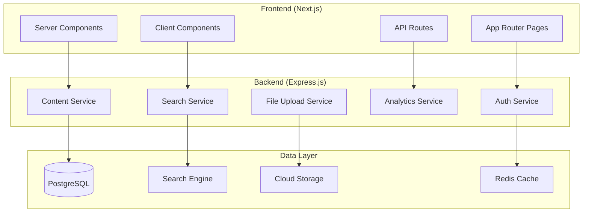

# Design Document

## Overview

The Creator Portfolio Hub is built as a modern full-stack web application using Next.js 14+ with App Router for the frontend and Express.js for the backend API. The architecture follows a microservices-inspired approach with clear separation between authentication, content management, search, recommendations, and analytics services. The system uses PostgreSQL for relational data, cloud storage for media files, and a search engine for discovery features.

## Architecture

### High-Level Architecture



### Technology Stack

**Frontend:**
- Next.js 14+ with App Router for server-side rendering and routing
- React Query (TanStack Query) for server state management
- Tailwind CSS for styling with Framer Motion for animations
- TypeScript for type safety
- Zod for client-side validation

**Backend:**
- Express.js with TypeScript
- Prisma ORM with PostgreSQL database
- JWT for authentication
- Zod for API validation
- BullMQ for background job processing
- Redis for caching and session storage

**Infrastructure:**
- AWS S3 or Firebase Storage for file storage
- Meilisearch or Elasticsearch for search functionality
- Docker for containerization
- Vercel/Netlify for frontend deployment

## Components and Interfaces

### Authentication System

**JWT Token Structure:**
```typescript
interface JWTPayload {
  userId: string;
  role: 'creator' | 'viewer';
  email: string;
  iat: number;
  exp: number;
}
```

**Auth Middleware:**
- Token validation middleware for protected routes
- Role-based access control (RBAC) for creator vs viewer permissions
- Refresh token rotation for enhanced security

### Content Management System

**Project Data Model:**
```typescript
interface Project {
  id: string;
  creatorId: string;
  title: string;
  description: string;
  content: string; // Rich text JSON from editor
  coverImage: string;
  mediaGallery: MediaItem[];
  tags: string[];
  techStack: string[];
  isPublished: boolean;
  createdAt: Date;
  updatedAt: Date;
  viewCount: number;
  engagementScore: number;
}

interface MediaItem {
  id: string;
  type: 'image' | 'video';
  url: string;
  thumbnailUrl?: string;
  alt?: string;
  caption?: string;
}
```

**Rich Text Editor Integration:**
- TipTap editor with custom extensions for media embedding
- Real-time autosave functionality
- Image upload with automatic optimization
- Video upload with thumbnail generation

### Search and Discovery Engine

**Search Index Structure:**
```typescript
interface SearchDocument {
  id: string;
  title: string;
  description: string;
  content: string;
  tags: string[];
  techStack: string[];
  creatorName: string;
  createdAt: number;
  viewCount: number;
  engagementScore: number;
}
```

**Search API Interface:**
```typescript
interface SearchQuery {
  query?: string;
  tags?: string[];
  techStack?: string[];
  sortBy?: 'relevance' | 'date' | 'popularity';
  page: number;
  limit: number;
}

interface SearchResponse {
  results: Project[];
  totalCount: number;
  facets: {
    tags: { [key: string]: number };
    techStack: { [key: string]: number };
  };
  suggestions?: string[];
}
```

### Recommendation System

**Embedding Generation:**
- Use project tags and tech stack to create vector embeddings
- Store embeddings in PostgreSQL using pgvector extension
- Calculate similarity using cosine similarity

**Recommendation Algorithm:**
```typescript
interface RecommendationEngine {
  getSimilarProjects(projectId: string, limit: number): Promise<Project[]>;
  getTrendingProjects(timeWindow: string): Promise<Project[]>;
  getPersonalizedRecommendations(userId: string): Promise<Project[]>;
}
```

**Trending Calculation:**
- Engagement velocity = (views + likes + follows) / time_since_published
- Weighted scoring based on recency and engagement type

### Analytics System

**Analytics Data Model:**
```typescript
interface ProjectAnalytics {
  projectId: string;
  date: Date;
  views: number;
  uniqueViews: number;
  clickThroughRate: number;
  engagementRate: number;
  referralSources: { [source: string]: number };
}

interface UserEngagement {
  userId: string;
  projectId: string;
  action: 'view' | 'like' | 'follow' | 'share';
  timestamp: Date;
  sessionId: string;
}
```

**Real-time Analytics Pipeline:**
- Event tracking using custom hooks
- Batch processing for aggregated metrics
- Dashboard with charts using Chart.js or Recharts

## Data Models

### Database Schema

**Users Table:**
```sql
CREATE TABLE users (
  id UUID PRIMARY KEY DEFAULT gen_random_uuid(),
  email VARCHAR(255) UNIQUE NOT NULL,
  password_hash VARCHAR(255) NOT NULL,
  role user_role NOT NULL,
  profile JSONB,
  created_at TIMESTAMP DEFAULT NOW(),
  updated_at TIMESTAMP DEFAULT NOW()
);
```

**Projects Table:**
```sql
CREATE TABLE projects (
  id UUID PRIMARY KEY DEFAULT gen_random_uuid(),
  creator_id UUID REFERENCES users(id) ON DELETE CASCADE,
  title VARCHAR(255) NOT NULL,
  description TEXT,
  content JSONB,
  cover_image VARCHAR(500),
  media_gallery JSONB,
  tags TEXT[],
  tech_stack TEXT[],
  is_published BOOLEAN DEFAULT false,
  view_count INTEGER DEFAULT 0,
  engagement_score FLOAT DEFAULT 0,
  embeddings vector(384), -- for similarity search
  created_at TIMESTAMP DEFAULT NOW(),
  updated_at TIMESTAMP DEFAULT NOW()
);
```

**Analytics Tables:**
```sql
CREATE TABLE project_analytics (
  id UUID PRIMARY KEY DEFAULT gen_random_uuid(),
  project_id UUID REFERENCES projects(id) ON DELETE CASCADE,
  date DATE NOT NULL,
  views INTEGER DEFAULT 0,
  unique_views INTEGER DEFAULT 0,
  ctr FLOAT DEFAULT 0,
  engagement_rate FLOAT DEFAULT 0,
  referral_sources JSONB
);

CREATE TABLE user_engagements (
  id UUID PRIMARY KEY DEFAULT gen_random_uuid(),
  user_id UUID REFERENCES users(id) ON DELETE CASCADE,
  project_id UUID REFERENCES projects(id) ON DELETE CASCADE,
  action engagement_action NOT NULL,
  timestamp TIMESTAMP DEFAULT NOW(),
  session_id VARCHAR(255)
);
```

## Error Handling

### API Error Response Format

```typescript
interface APIError {
  success: false;
  error: {
    code: string;
    message: string;
    details?: any;
  };
  timestamp: string;
}
```

### Error Categories

1. **Authentication Errors (401)**
   - Invalid or expired tokens
   - Missing authentication headers
   - Role permission violations

2. **Validation Errors (400)**
   - Invalid input data
   - Missing required fields
   - File upload size/type violations

3. **Not Found Errors (404)**
   - Project not found
   - User not found
   - Resource not accessible

4. **Server Errors (500)**
   - Database connection failures
   - File upload failures
   - Search service unavailable

### Error Handling Strategy

- Global error boundary in React for frontend error catching
- Express error middleware for centralized API error handling
- Retry logic for transient failures (file uploads, search queries)
- Graceful degradation for non-critical features (recommendations, analytics)

## Testing Strategy

### Frontend Testing

**Unit Tests:**
- Component testing with React Testing Library
- Custom hook testing
- Utility function testing
- Form validation testing

**Integration Tests:**
- API integration testing
- Authentication flow testing
- File upload workflow testing
- Search functionality testing

**E2E Tests:**
- User registration and login flows
- Project creation and publishing workflow
- Search and discovery user journeys
- Analytics dashboard functionality

### Backend Testing

**Unit Tests:**
- Service layer testing
- Database model testing
- Validation schema testing
- Utility function testing

**Integration Tests:**
- API endpoint testing
- Database integration testing
- File upload service testing
- Search service integration

**Performance Tests:**
- Load testing for high-traffic scenarios
- Database query performance testing
- File upload performance testing
- Search response time testing

### Test Data Management

- Database seeding for consistent test environments
- Mock data generators for realistic testing scenarios
- Test database isolation for parallel test execution
- Automated test data cleanup

### Continuous Integration

- Automated test execution on pull requests
- Code coverage reporting with minimum thresholds
- Performance regression testing
- Security vulnerability scanning